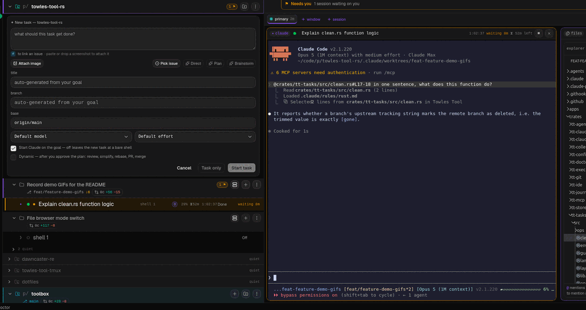
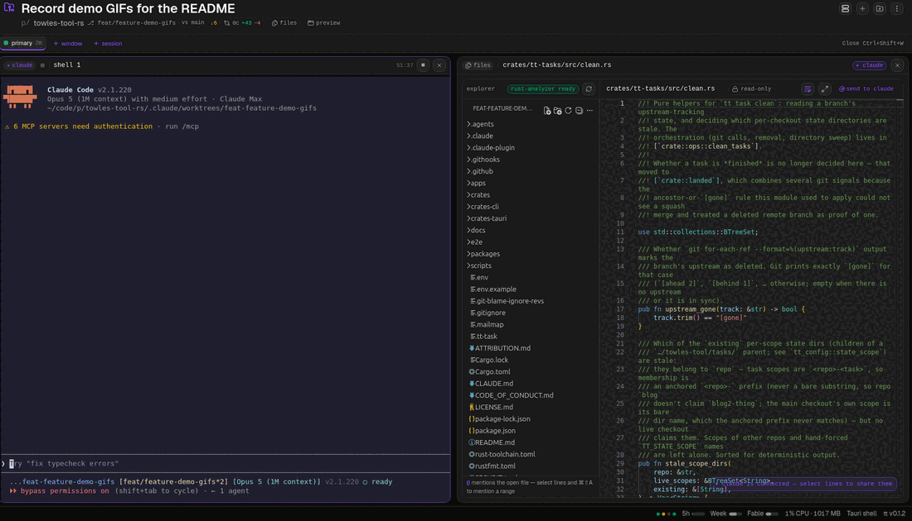
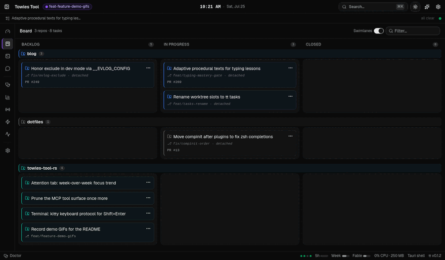
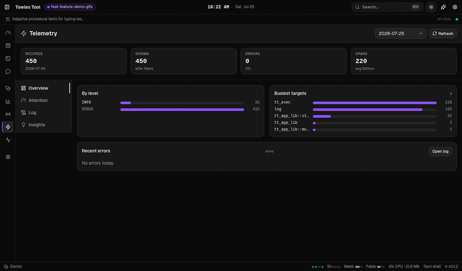
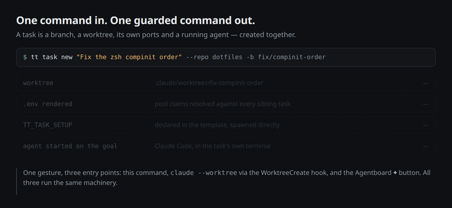
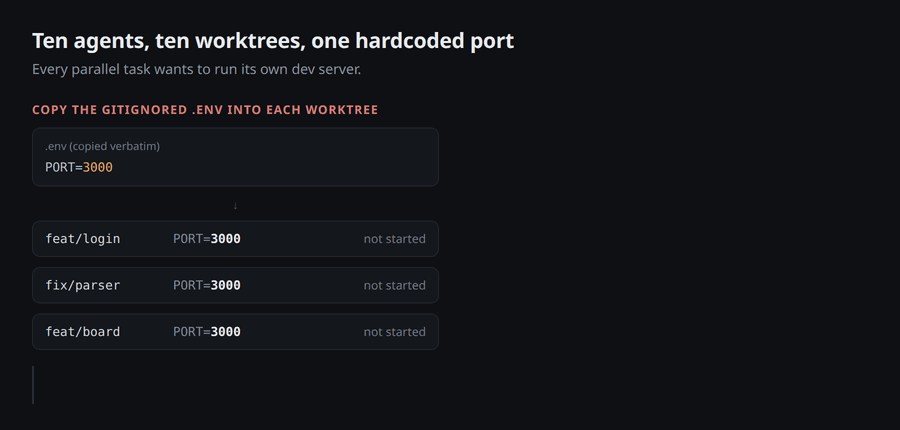
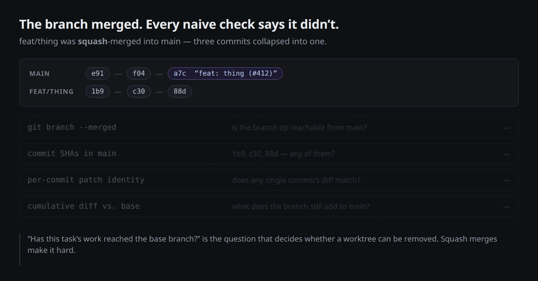
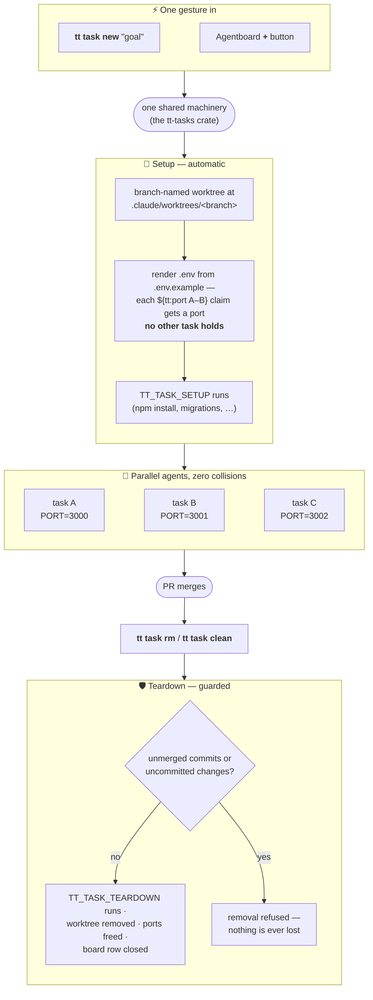

# Towles Tool (Rust)

> [!WARNING]
> **This is a personal playground.** It exists so I can learn by building.
> If you want to steer many coding agents, use
> [Claude Desktop](https://code.claude.com/docs/en/desktop-linux) instead —
> that goes for me too.

A [Tauri 2](https://v2.tauri.app/) desktop app plus the `tt` CLI, built for one
job: **going from steering one coding agent to steering many without going
insane.**

How well the agents work is Claude Code's problem. This is the **agent
interface** around it — how I hand work in, and how I know what came back.

## Why this exists

Two reasons:

1. **The Codex and Claude Code desktop apps didn't run on Linux.** This work
   happens on a Linux desktop, so the shell had to be built. (Claude Desktop
   [now has a Linux beta](https://code.claude.com/docs/en/desktop-linux) —
   released June 30, 2026, the day before this repo's first commit.)

2. **Existing tools were a good GUI or a good TUI, never both.** This app
   aims to be both: a real GUI around real terminals.

## Features: in towles-tool, not yet in Claude Desktop

Checked on 2026-07-19 against Claude Desktop **1.22209.0** (built 2026-07-16),
using the published [docs](https://code.claude.com/docs/en/desktop) plus the
installed bundle. Biggest gap first. Read the overlap list under it too: most
of what this repo does, Desktop now does as well.

- **Handing work to an agent is one gesture.** The Agentboard `+` takes a
  half-formed thought, a pasted screenshot, and `#` to attach one of the repo's
  open issues so the goal points at what it's for. Submit it as typed, or press
  a prompt improver first — Direct, Plan and Brainstorm ship as defaults, each
  an instruction you can edit — and claude rewrites the goal with the repo and
  the image in view, proposing the title and branch. That lands in the fields,
  editable, with Undo. Submitting mints the worktree, renders its `.env`, runs
  the repo's setup and starts Claude on that goal, all before you look away.
  From then on the rail is the monitor: agent state, which model is running it
  (Fable or Sonnet), uncommitted diff, linked PR. Teardown is the same gesture
  in reverse, and it refuses while the task still holds work only it can prove.

  

- **A file editor Claude Code can see into.** `tt-ide` makes the app an IDE-protocol server, so the Monaco editor in the Files pane is wired to the Claude Code session running in that folder's terminal. Highlight lines and the selection streams live into the session — the editor shows `L17-18 live to claude`, the CLI shows `2 lines selected` — and `@ send` turns it into an `@file#L17-18` reference in the prompt. Editing and saving go the same way. Desktop only takes context from its own panes, via spot edits, "Attach as context", and `@`-mention autocomplete; it cannot see a selection in an editor beside it.

  

  The same pane also bridges rust-analyzer over Tauri IPC for hover and
  completions on Rust source, and a `path:line` link printed in a terminal
  opens the file at that line. That LSP bridge is still a spike — it reports
  `starting`/`ready`/`failed` in a chip, which is there to decide whether it
  earns its keep.

- **Cross-repo work board.** Board is a kanban of tasks spanning every watched
  repo. Each task links 0..N issues, 0..N PRs, and usually a worktree,
  and done rolls up from GitHub PR state. Desktop has nothing like it. Its
  "tasks pane" holds background subagents inside a single session, and no
  cross-repo surface exists.

  

- **Always-on local event log.** Every subprocess and user action lands as
  JSONL at `<data_dir>/telemetry/events-<date>.jsonl`, rotated daily, tagged
  with `tt.task`, queryable with `jq`, and never sent anywhere. Desktop's
  OpenTelemetry surface is more configurable than this repo's, but it exports
  to a collector you run. I found no sign of an on-disk log that is on by
  default, though I read strings in the bundle rather than watching it run.

  

- **Guarded task lifecycle.** `tt task new` in, `tt task rm`/`clean` out, with
  a setup hook, a port lifecycle and a removal guard hung off either end (the
  whole cycle is under [Worktree tasks](#worktree-tasks)). Desktop creates
  worktrees and auto-archives them on PR merge or close, but has none of those
  three — in particular no removal guard for a branch that never had a PR.

  

- **Per-task port isolation.** Both tools put worktrees in
  `.claude/worktrees/`. The difference is the `${tt:port A-B}` claim: every
  task renders its own `.env`, so ten tasks run ten dev servers without
  colliding. Desktop's `.worktreeinclude` copies gitignored files verbatim,
  which hands every worktree the same port.

  

- **Squash-merge-aware landing detection.** The guard above rests on it: only
  the branch's cumulative diff against base can prove a squash merge landed.
  Desktop auto-archives a worktree once its PR merges or closes, which covers
  the common case but never has to answer whether a branch with no PR still
  holds work.

  

### Overlap: things Desktop already does

Written down so this repo stops claiming them. Desktop ships automatic git
worktrees at the same `.claude/worktrees/` path with auto-archive on PR merge,
a real `node-pty` terminal, a file pane with editing and save-conflict
detection, file-by-file diff review with batched per-line comments, PR CI
monitoring with auto-fix and auto-merge, GUI plugin and MCP management,
scheduled tasks, and a browser pane with element selection. On PR automation
and telemetry configurability it is ahead of this repo.

What Desktop lacks is a shorter list than it first appears. It runs
interactive only, with no `--print` and no headless entry point, so there is no
equivalent of `tt collect`. The Linux beta also has no
Computer Use, no dictation, and no self-update.

## What this is (and is not)

Claude Code is the harness. This is the **agent interface** around it —
everything between me and the agents, in both directions.

The harness improves without me, on eval budgets I'll never have. The interface
is the half I can actually move, and the half I feel every hour. Karpathy's
Software 3.0 framing is the one I keep returning to: generation is cheap,
**verification is the bottleneck**, and what speeds a human up is a GUI that
makes checking fast.

So every feature answers one question: does it widen that channel — more
precision going in, more understanding coming out? Making the agent better at
its job is out of scope, because I could never afford to A/B-test whether it
worked, and anything cheaper is vibe testing under ten scenarios. That kind of
feature arrives disguised as a helpful checkbox: launch in plan mode, then
implement, review, rebase, open the PR, merge. That's a harness wearing a
checkbox, and it belongs in a Claude Code slash command
([`packages/core`](packages/core/README.md)), invoked on purpose.

The few prompts here are all one shape: ask claude a question, get JSON back,
act on it. Each is a string you edit in Settings, not a pipeline compiled into
the app.

That channel has two halves, and they're the two things this repo owns:

- **Handing work in.** A new task should cost one gesture: goal → branch →
  isolated worktree with its own ports, agent already started on the goal.
  That's `tt task` and the Agentboard `+` button.
- **Understanding the work coming out.** Which session needs you *right now*,
  what each one did, what it cost in tokens, and a real terminal to drop into
  when it's your turn — without re-reading every line an agent wrote.

The target is the space between a **dark factory**, where agents do the work
and you never see the code, and an **IDE**, where you see every line. One agent
fits in an IDE; a fleet doesn't fit in your head. That's the mental load every
feature here is trying to reduce.

## Four media

Four ways of showing things here, because none of them covers everything:

- **HTML/GUI** — dashboards, queues, lists.
- **Terminal** — a real PTY, where the agents actually work.
- **Git repos** — storage, and how you hand work to someone else.
- **Bevy** — 3D, realistic environments.

Bevy is the newest and least built out.

## Critical goal: Solari, running natively inside the app

The app renders a live **Bevy** scene in a real region of its own window. A
native compositor surface (`wl_subsurface` on Wayland, `NSView`/`CAMetalLayer`
on macOS) sits in a rectangle of the Tauri window and Bevy draws into it on the
GPU — no WebAssembly, no frames streamed over IPC.

Bevy comes from [slyedoc/bevy](https://github.com/slyedoc/bevy), branch
`solari-rt-pipeline`, rather than crates.io. That fork is where **Solari**,
Bevy's real-time raytraced lighting, is being built, and the goal is to run it
live in a tool used all day — on a real desktop with real windows, not only in
engine demos. Only a native surface can host a hardware ray-tracing pipeline,
which is what settles the embedding approach.

`Cargo.lock` pins the revision, so builds stay reproducible and
`cargo update -p bevy` moves onto newer work deliberately. Upstream API churn
is the price of being close to the work.

The embedding lives in `crates/tt-jarvis` and `crates-tauri/tt-pane`.

## The two surfaces

**The desktop app** is the primary product — a day-focus shell for staying in
the zone while agents work:

- **Agentboard** — the fleet in one rail: every watched repo, its worktree
  tasks, and a live terminal per session, rendered on canvas from a real PTY
  (the `tt-vt` engine, built on libghostty-vt). Agent status is *reported,
  never re-rendered*: the app tells you a session needs attention, and you
  interact in the actual terminal, not a reconstruction of it.
- **Cockpit** — the default day home: time until the next meeting (that is the
  entire calendar feature, by design), your PRs with CI status, and the issue
  queue.
- **Board** — cross-repo kanban of tasks (#339): each links issues/PRs and usually a worktree; done rolls up from GitHub.
- **Claude Sessions** — where the tokens went: per-session accounting, ranked
  waste insights, and a turn/tool drill-down.

**The CLI** (`tt`) is the terminal-native half, and deliberately small: journal
and notes, worktrees (`tt task`), and the headless `collect` entry point
the store rides on. There is deliberately no CLI/app
parity: each feature lands on its natural surface, and the shared logic lives in
Tauri-free crates that both consume.

> **Status:** the port off the TypeScript CLI is done — the journal, worktrees,
> the data-hub store/collectors, the MCP server, the Claude Sessions screen, and
> the Agentboard screens (with live in-app terminals) all live here. New work is
> features of the app itself, not ports.

## Quick start

**Prerequisites**

- Node.js 24+
- Rust (stable toolchain)
- [zig](https://ziglang.org/) 0.15.x on `PATH` — the `tt-vt` terminal engine
  (used by the app's in-canvas terminals) builds against libghostty-vt
- Linux: `webkit2gtk` and the usual Tauri system dependencies
  (see the [Tauri prerequisites](https://v2.tauri.app/start/prerequisites/))

**Run the desktop shell**

```sh
npm install
npm run dev      # tauri dev — launches the app with the Vite frontend
```

Each worktree picks its own dev-server port automatically, so multiple
tasks run concurrently.

**Run the CLI**

```sh
cargo run -p tt-cli -- task ls
```

## Worktree tasks

Tasks are the "handing work in" half made concrete: branch-named git worktrees
nested inside the checkout at `.claude/worktrees/<name>/` — Claude Code's
native worktree location — one per parallel line of work, each with its own
rendered `.env` (port-pool claims, inherited secrets) so concurrent agents
never collide on ports or state. Any plain git checkout becomes task-capable
with `tt task init`; tasks are ephemeral — created for a branch, removed when
it merges.

The whole lifecycle is one gesture in and one command out, and every entry
point — CLI, Claude Code, or the app — runs the same machinery:



The port claims are the part that makes ten concurrent tasks boring instead of
painful. `.env.example` is the template: declare a `${tt:port A-B}` pool claim
once (plus `${tt:task-name}` and `${tt:var NAME}` for pass-throughs), and every
task renders its own `.env` from it with ports no sibling task holds — a repo
that can't carry tokens in its `.env.example` uses the
`.claude/task-env.template` sidecar as the template instead. The render is
idempotent: when the template changes, `tt task env <name>` (or
`tt task env primary` for the main checkout) re-renders the `.env` while
keeping the ports the task already claimed, and a gitignored `.env.local`
overrides any rendered value by hand. Nothing in the repo ever hardcodes a
port.

Teardown runs the same way in reverse — `TT_TASK_TEARDOWN`, worktree removed,
ports freed, board row closed — but only past the guard in the diagram above:
removal refuses while a task still holds uncommitted changes or commits that
never reached base, and only content-based proof authorizes `git branch -D`.
That proof has to be cumulative, because a squash-merged branch *looks*
unmerged to reachability and per-commit patch identity alike; the `landed`
module in `tt-tasks` is where that lives.

Manage tasks with `tt task` (`init`, `new`, `ls`, `env`, `rm`, `clean`) —
never raw `git worktree`. Claude Code's own worktree surfaces
(`claude --worktree`, the app's parallel sessions) make their own worktrees
and are not tasks. The Agentboard rail shows the whole fleet and can create a
task from its `+` button. Full convention and rules: [CLAUDE.md](CLAUDE.md).

## Claude Code plugin

The repo doubles as a Claude Code plugin marketplace. The `tt` plugin (in
[`packages/core`](packages/core/README.md)) packages the map-vs-territory
workflow commands — before implementation (`/tt:blindspot`,
`/tt:brainstorm`, `/tt:interview`, `/tt:references`), plan/during
(`/tt:plan`), after (`/tt:pitch`, `/tt:comprehend`, `/tt:memories`,
`/tt:handoff`).

The `towles-tool-app` plugin (in
[`packages/app`](packages/app/README.md)) bridges Claude Code to the desktop
app itself: it registers the app's MCP server over loopback HTTP (board tasks
and the calendar family), ships the `towles-tool` CLI reference and
`task-onboarding` skills, and adds a hook that nudges a running app instance to
refresh its PR or issue data immediately after a `gh pr`/`gh issue` mutation,
instead of waiting for its normal poll interval.

Install in Claude Code:

```sh
claude plugin marketplace add ChrisTowles/towles-tool
claude plugin enable tt@towles-tool
claude plugin enable towles-tool-app@towles-tool
```

Already installed? Pull the latest version with
`claude plugin marketplace update towles-tool`.

## Commands

The CLI binary is `tt`. Run any command with `--help` for its flags.

- `journal daily-notes|note|meeting|jot|open|list|search` — filesystem notes with date-token path templates (`today` is an alias for `daily-notes`; `jot` appends a timestamped bullet without opening an editor).
- `task init|new|ls|rm|env|ports|clean` — manage worktrees (see [Worktree tasks](#worktree-tasks) above). `ports` reports the repo's port picture (every checkout's claims merged with the registry, each probed for a listener; `--probe <port>` checks a single port instead).
- `collect calendar|issues|prs|slack|all|status|nudge <prs|issues>` — fill the local store: today's calendar via `claude -p`, assigned issues and open/review-requested PRs via `gh`, and a watched Slack DM; `status` reports each collector's health; `nudge <prs|issues>` makes a running app instance refresh that data immediately instead of waiting for its normal poll interval (used by the `towles-tool-app` plugin's `gh pr`/`gh issue` mutation hook).

## Crates

Cargo workspace with Tauri-free shared crates plus the CLI and Tauri shells:

- `crates/tt-config` — settings (shared on disk with the TypeScript CLI) and the single resolver for every mutable state path.
- `crates/tt-exec` — process/command wrappers.
- `crates/tt-journal` — journal/note logic and date-token path templating.
- `crates/tt-git` — git/GitHub helpers (branch names, PR content, issue parsing).
- `crates/tt-claude-sessions` — session token accounting, ranked waste insights, and the per-session drill-down behind the app's Claude Sessions screen.
- `crates/tt-doctor` — dependency/environment checks behind the app's Doctor screen.
- `crates/tt-tasks` — the worktree-task convention: `${tt:...}` env-template renderer with port-pool claims, task naming/layout, removal guards, and the shared `ops` orchestration behind `tt task` and the app.
- `crates/tt-claude-code` — shared Claude Code transcript parsing (session JSONL, titles, token usage, model table).
- `crates/tt-store` — the data-hub SQLite store (events, board tasks with issue/PR links + task bindings, issues, PR status, collector freshness).
- `crates/tt-collect` — collectors that fill the store: calendar via `claude -p`, issues/PRs via `gh`, a watched Slack DM via the Slack Web API.
- `crates/tt-agentboard` — watched-repo and agent-session tracking behind the Agentboard screen.
- `crates/tt-ide` — Claude Code IDE-protocol core: the MCP/JSON-RPC dispatcher and lockfile schema the app uses to pose as an IDE that Claude Code sessions connect to.
- `crates/tt-vt` — libghostty-vt terminal-state engine driving the app's canvas terminals (needs zig 0.15.x).
- `crates/tt-jarvis` — the Bevy scene behind the native pane, rendered into a surface it did not create (Bevy from [slyedoc/bevy](https://github.com/slyedoc/bevy)).
- `crates/tt-mcp` — the transport-free JSON-RPC MCP server over the store: board tasks (`task_list`, `task_status`, `task_create`, `task_summary`, `task_start`, `task_delete`), `preview_show` (put an HTML page the agent wrote on screen in the app's Preview pane) and the calendar family (`calendar_today`, `calendar_next`, `calendar_set`). Each app instance serves it over loopback HTTP on its own `${tt:port 8787-8986}` claim (`TT_MCP_PORT`, stamped into the terminals it spawns so a session reaches the app it belongs to; `${TT_MCP_PORT:-8787}` otherwise) — app closed means no MCP for that checkout. See the crate's trust-boundary doc.
- `crates/tt-telemetry` — telemetry: the `tracing` subscriber/writer for the
  local JSONL event log every subprocess and user action lands in, plus the
  reader behind the app's Telemetry screen.
- `crates/tt-update` — GitHub Releases update check for the running app.
- `crates-cli/tt-cli` — the `clap` CLI (binary `tt`).
- `crates-tauri/tt-app` — the Tauri 2 desktop shell; `apps/client` is its React + Vite frontend.
- `crates-tauri/tt-pane` — puts `tt-jarvis`'s output on screen: a native compositor surface pinned to a rectangle of the app window.

## Lineage

This is a Rust rewrite of the original TypeScript `towles-tool`, now archived
and renamed to
[`towles-tool-tmux`](https://github.com/ChrisTowles/towles-tool-tmux) — its
tmux-based AgentBoard is kept there as a reference example. The repo structure
follows the [Yaak](https://github.com/mountain-loop/yaak) golden template — a
Cargo workspace with Tauri-free shared crates, a `clap` CLI, and a React + Vite
frontend (see [ATTRIBUTION.md](ATTRIBUTION.md)). The binary is **`tt`**; the
`ttr` → `tt` cutover from the TypeScript CLI happened 2026-07-13 — hard
cutover, no `ttr` alias left behind (see [docs/CUTOVER.md](docs/CUTOVER.md)).
Features were ported over selectively, and that port is complete —
[docs/MIGRATION.md](docs/MIGRATION.md) is the historical record of what came
across and what was dropped.

## More

- [packages/core/README.md](packages/core/README.md) — the `tt` Claude Code plugin in detail
- [packages/app/README.md](packages/app/README.md) — the `towles-tool-app` Claude Code plugin in detail
- [ATTRIBUTION.md](ATTRIBUTION.md) — derivation from Yaak and its MIT license
- [docs/MIGRATION.md](docs/MIGRATION.md) — historical: the completed feature port off the TS CLI
- [.claude/rules/](.claude/rules) — Rust/TypeScript conventions, auto-loaded for the files they cover
- [e2e/README.md](e2e/README.md) — driving the real app shell (live-drive + regression suite)
- [CLAUDE.md](CLAUDE.md) — project instructions, architecture, and the worktree-task workflow

## License

MIT © 2026 Chris Towles. See [LICENSE.md](LICENSE.md).
