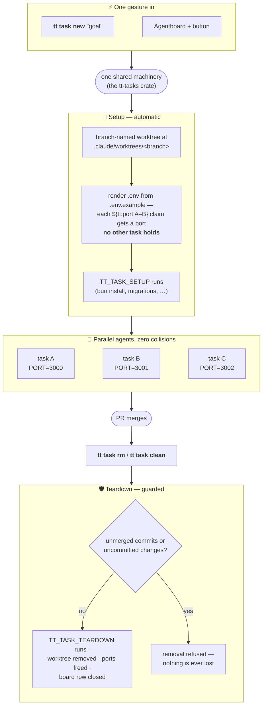

# Worktree tasks — the user's guide

Running several agents in parallel, one git worktree each. The
[README](../README.md) has the short version; the conventions a contributor (or
an agent) needs are in [WORKTREE-TASKS.md](WORKTREE-TASKS.md).

Tasks are the "handing work in" half made concrete: branch-named git worktrees
nested inside the checkout at `.claude/worktrees/<name>/` — Claude Code's
native worktree location — one per parallel line of work, each with its own
rendered `.env` (port-pool claims, inherited secrets) so concurrent agents
never collide on ports or state. Any plain git checkout becomes task-capable
with `tt task init`; tasks are ephemeral — created for a branch, removed when
it merges.

The whole lifecycle is one gesture in and one command out, and every entry
point — CLI, Claude Code, or the app — runs the same machinery:

The port claims are the part that makes ten concurrent tasks boring instead of
painful. `.env.example` is the template: declare a `${tt:port A-B}` pool claim
once (plus `${tt:task-name}` and `${tt:var NAME}` for pass-throughs), and every
task renders its own `.env` from it with ports no sibling task holds — a repo
that can't carry tokens in its `.env.example` uses the
`.claude/task-env.template` sidecar as the template instead. The render is
idempotent: when the template changes, `tt task env <name>` (or
`tt task env primary` for the main checkout) re-renders the `.env` while
keeping the ports the task already claimed, and a gitignored `.env.local`
overrides any rendered value by hand. Nothing in the repo ever hardcodes a
port.

Teardown runs the same way in reverse — `TT_TASK_TEARDOWN`, worktree removed,
ports freed, board row closed — but only past the guard in the diagram above:
removal refuses while a task still holds uncommitted changes or commits that
never reached base, and only content-based proof authorizes `git branch -D`.
That proof has to be cumulative, because a squash-merged branch *looks*
unmerged to reachability and per-commit patch identity alike; the `landed`
module in `tt-tasks` is where that lives.

Manage tasks with `tt task` (`init`, `new`, `ls`, `env`, `rm`, `clean`) —
never raw `git worktree`. Claude Code's own worktree surfaces
(`claude --worktree`, the app's parallel sessions) make their own worktrees
and are not tasks. The Agentboard rail shows the whole fleet and can create a
task from its `+` button. Full convention and rules: [CLAUDE.md](CLAUDE.md).
