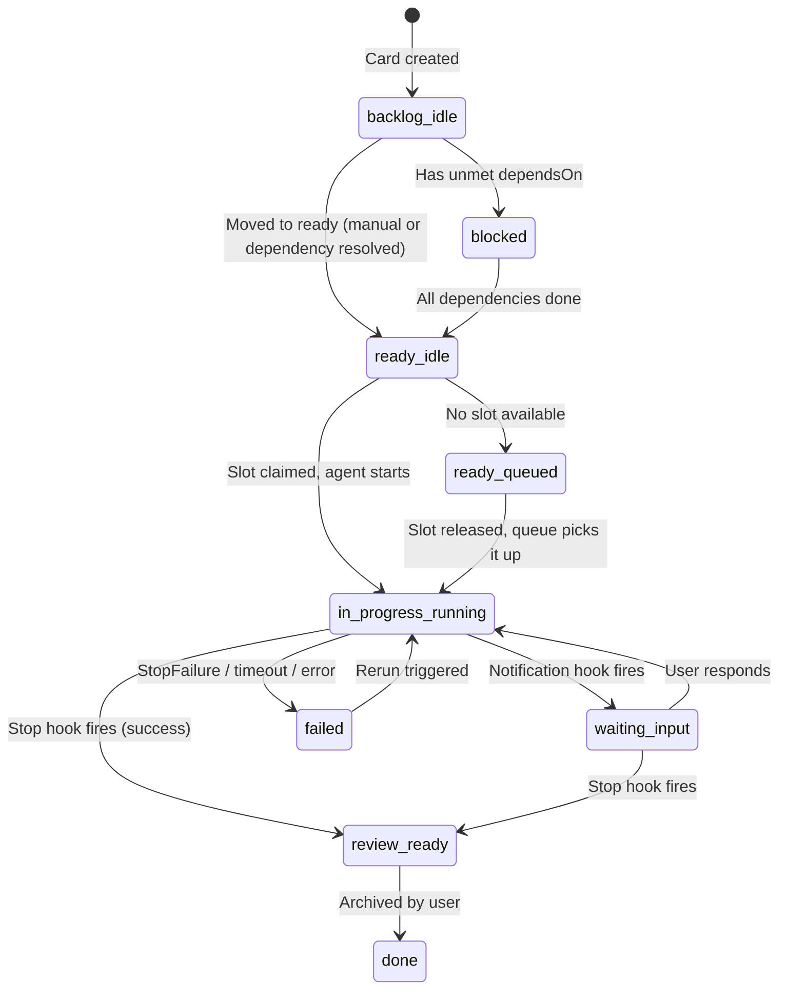
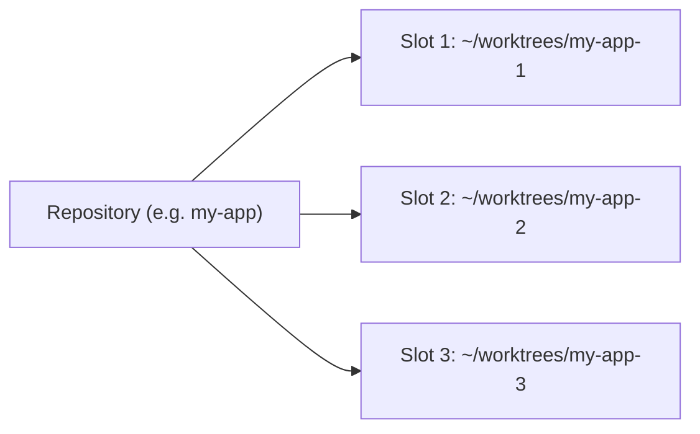
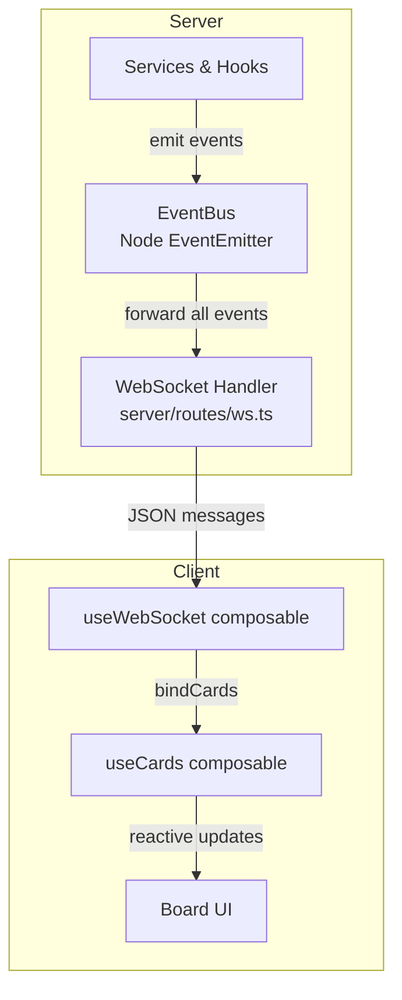

# AgentBoard System Flow

AgentBoard is a Nuxt 4 app that manages autonomous Claude Code agents via a Kanban board UI. Cards represent tasks; each card can be assigned to a repo, given a prompt, and executed by spawning Claude Code in a tmux session. Completion is detected via Claude Code HTTP lifecycle hooks, not polling.

## Core Concepts

| Concept | Description |
|---------|-------------|
| **Board** | Kanban board with columns: backlog, ready, in_progress, review, done |
| **Card** | A task with title, description, repo, status, optional workflow and GitHub issue link |
| **Repository** | A registered Git repo (org, name, default branch, GitHub URL) |
| **Workspace Slot** | A directory (git worktree) tied to a repo. Each running agent needs one slot. |
| **Workflow** | Multi-step YAML pipeline loaded from `.agentboard/workflows/*.yaml` in a repo |
| **Plan** | Groups cards with shared PR granularity (per_card or per_plan) |

## Card Lifecycle



**Column/status mapping:**

| Column | Statuses |
|--------|----------|
| backlog | idle, blocked |
| ready | idle, queued |
| in_progress | running, waiting_input |
| review | review_ready |
| done | done |

## Agent Execution Flow

Two execution paths depending on whether the card has a `workflowId`:

### Single-Prompt Execution (`agent-executor.ts`)

Used when a card has no workflow or the workflow is not found.

```
Card moved to in_progress
  1. Claim workspace slot (or queue if none available)
  2. Write .claude/settings.local.json with Stop/Notification hooks
  3. Create tmux session (card-{id}) in slot directory
  4. Git branch handling:
     - Reuse branch from previous run if exists (rerun case)
     - Or: checkout main, pull, create agentboard/card-{id}
     - Or: stay on current branch (branchMode=current)
  5. Install dependencies (pnpm/bun/npm based on lockfile)
  6. Create workflow_runs DB record
  7. Build claude CLI command:
     claude --dangerously-skip-permissions --max-turns 50 \
       --append-system-prompt "..." -p "<card description>"
  8. Send command to tmux session
  9. Start tmux capture (polling capture-pane every 500ms)
```

Completion is async -- the Stop hook POSTs to `/api/agents/{cardId}/complete`.

### Workflow Execution (`workflow-runner.ts`)

Used when a card has a valid `workflowId`. Runs multiple Claude invocations in sequence.

```
Card moved to in_progress
  1. Init context: fetch card, repo, workflow definition
  2. Claim slot, create tmux session, start output capture
  3. Create git branch from workflow.branch_template
  4. For each step in workflow.steps:
     a. Write hooks pointing to /api/agents/{cardId}/step-complete
     b. Build prompt via context-bundler (template + previous artifacts + CLAUDE.md)
     c. Send claude -p command to tmux
     d. Wait for step-complete callback (10min timeout)
     e. Check artifact exists at step.artifact path
     f. Check pass_condition against artifact content
     g. On failure: retry up to step.max_retries, or follow on_fail goto
  5. Run post_steps (push branch, create PR via gh CLI)
  6. Move card to review/review_ready
  Finally: kill tmux, release slot (triggers queue-manager)
```

### Hook Callback Endpoints

| Endpoint | Hook | Effect |
|----------|------|--------|
| `POST /api/agents/{cardId}/complete` | Stop | Auto-commit uncommitted changes, kill tmux, release slot, move card to review |
| `POST /api/agents/{cardId}/step-complete` | Stop (workflow) | Resolves pending step promise so workflow-runner proceeds to next step |
| `POST /api/agents/{cardId}/notification` | Notification | Set card status to waiting_input |

The hooks are written to `.claude/settings.local.json` in the slot directory:

```json
{
  "hooks": {
    "Stop": [{ "matcher": "", "hooks": [{ "type": "http", "url": "http://localhost:4200/api/agents/{cardId}/complete" }] }],
    "Notification": [{ "matcher": "", "hooks": [{ "type": "http", "url": "http://localhost:4200/api/agents/{cardId}/notification" }] }]
  }
}
```

## Workspace Slot System

Slots are git worktrees registered in the DB, each tied to a repository.



**Slot statuses:** available | claimed | locked

**Lifecycle:**
1. **Claim** (`slot-allocator.claimSlot`): finds first available slot for the repo, sets status=claimed, claimedByCardId=cardId
2. **Use**: agent runs in the slot directory (git ops, claude CLI)
3. **Release** (`slot-allocator.releaseSlot`): sets status=available, claimedByCardId=null, emits `slot:released`

**Concurrency control:**
- `MAX_CONCURRENT_AGENTS` (env var, default 3) limits total running agents
- Each repo can run as many agents as it has available slots
- When no slot is available, the card is set to `queued` in the `ready` column

## Queue Manager

The queue-manager plugin listens for `slot:released` and `card:status-changed` events:

1. When a slot is released: find the next queued or ready/idle card for that repo
2. Pre-claim the slot for the card to prevent races
3. Move card to in_progress, start execution
4. Respects MAX_CONCURRENT_AGENTS before starting

Ready/idle cards auto-start when a slot becomes available (no manual move to in_progress needed).

## Real-time Updates



**Server side:** All services emit events on the shared `eventBus` (Node EventEmitter). The WebSocket handler (`server/routes/ws.ts`) forwards every event to connected clients.

**Event types:**
- `card:moved` -- column change
- `card:status-changed` -- status change
- `step:started/completed/failed` -- workflow step progress
- `slot:claimed/released` -- slot lifecycle
- `agent:output` -- tmux terminal output
- `agent:waiting` -- agent needs input
- `workflow:completed` -- workflow finished
- `github:issue-found` -- new issue detected by poller

**Client side:** `useWebSocket` composable manages a singleton WebSocket connection with auto-reconnect. `bindCards` wires events to reactive card state updates. Terminal output is subscription-based: clients send `subscribe-terminal` message to start receiving tmux capture output for a specific card.

**Terminal streaming:** tmux `capture-pane` is polled every 500ms (server-side). Output is emitted as `agent:output` events, forwarded via WebSocket only to clients subscribed to that card's channel.

## Key Services

| Service | File | Purpose |
|---------|------|---------|
| **tmux-manager** | `services/tmux-manager.ts` | Create/kill tmux sessions, send commands, poll terminal output via capture-pane |
| **agent-executor** | `services/agent-executor.ts` | Single-prompt execution: slot claim, branch setup, deps install, spawn claude CLI |
| **workflow-runner** | `services/workflow-runner.ts` | Multi-step pipeline: iterate steps, wait for callbacks, check artifacts/pass conditions, retry |
| **workflow-loader** | `services/workflow-loader.ts` | Load YAML workflow definitions from `.agentboard/workflows/`, watch for changes with chokidar |
| **context-bundler** | `services/context-bundler.ts` | Build step prompts: template vars, previous artifacts, dependency diffs, CLAUDE.md |
| **slot-allocator** | `services/slot-allocator.ts` | Claim/release workspace slots per repo |
| **dependency-resolver** | `services/dependency-resolver.ts` | Track card dependencies (dependsOn field), unblock cards when deps complete |
| **github-service** | `services/github-service.ts` | GitHub operations via `gh` CLI: list issues, create PRs, manage labels, poll for trigger labels |
| **ttyd-manager** | `services/ttyd-manager.ts` | Spawn ttyd processes to expose tmux sessions as web terminals (port 7700+) |

## Nitro Plugins (Startup)

| Plugin | File | Purpose |
|--------|------|---------|
| **seed** | `plugins/seed.ts` | Ensure default board exists |
| **session-reconnect** | `plugins/session-reconnect.ts` | On startup: reconcile running cards with live tmux sessions, kill orphans, resume captures |
| **queue-manager** | `plugins/queue-manager.ts` | Auto-start queued/ready cards when slots become available |
| **dependency-watcher** | `plugins/dependency-watcher.ts` | When a card completes, unblock dependent cards and move them to ready |
| **github-poll** | `plugins/github-poll.ts` | Poll GitHub issues with trigger labels, auto-create cards |
| **github-label-sync** | `plugins/github-label-sync.ts` | Sync card status to GitHub issue labels (in_progress/success/failure) |

## Database Schema

SQLite via Drizzle ORM. Key tables:

- **repositories** -- registered repos (name, org, defaultBranch, githubUrl)
- **workspace_slots** -- worktree directories per repo (path, status, claimedByCardId)
- **boards** -- kanban boards (just a name)
- **cards** -- tasks (title, description, column, status, repoId, workflowId, dependsOn, githubIssueNumber, etc.)
- **plans** -- card groupings with PR granularity
- **workflow_runs** -- execution records (cardId, workflowId, slotId, tmuxSession, branch, status)
- **step_runs** -- per-step execution records within a workflow run
- **card_events** -- audit log of all card lifecycle events
- **agent_logs** -- captured agent output per workflow run
